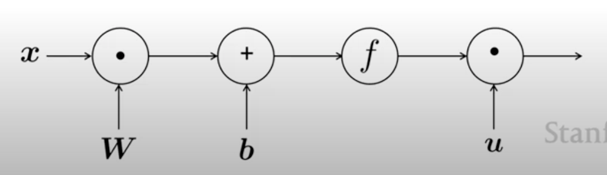
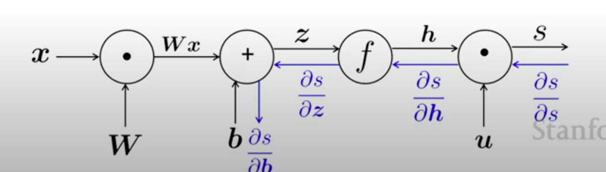

# Backprop on NER
One way of carrying out NER is to classify each word in its context window of neighbouring words. We can use a logistic classifier on a concatenation of word vectors in a window. Mathematically,
$$\begin{split}
x &= x_{t-m} \oplus \cdots \oplus x_{t+m} \\
h &= f(Wx + b) \\
s &= u^Th \end{split}$$
This gives the prediction
$$J_t(\theta) = \frac{1}{1+e^{-s}}$$

We will follow the back-propagation of gradients across this simple network.

We have the equation
$$\theta^\text{new} = \theta^\text{old} - \alpha \nabla_\theta J(\theta),$$
and for each parameter,
$$\theta_j^\text{new} = \theta_j^\text{old} - \alpha \frac{\partial J(\theta)}{\partial \theta_j^\text{old}}$$

## Calculation by Hand
### Jacobian Matrices
We will use the notation
$$\left(\frac{\partial f}{\partial x}\right)_i = \frac{\partial f}{\partial x_i}$$
for multiple-input, single-output functions.  
For a multiple-input, multiple-output function
$$f(x) = [f_1(x_1, \dots, x_n), \dots, f_m(x_1, \dots, x_n)],$$
we use the Jacobian
$$\frac{\partial f}{\partial x} = \begin{bmatrix}
\frac{\partial f_1}{\partial x_1} & \cdots & \frac{\partial f_1}{\partial x_n} \\
\vdots & \ddots & \vdots \\
\frac{\partial f_m}{\partial x_1} & \cdots & \frac{\partial f_m}{\partial x_n}
\end{bmatrix},$$
*i.e.*,
$$\left(\frac{\partial f}{\partial x}\right)_{ij} = \frac{\partial f_i}{\partial x_j}.$$

The Jacobian can be multiplied using the chain rule, analogously to single-variable derivatives.

For example, consider an elementwise activation function $f$. We wish to compute the derivative of $h = f(z)$. This gives us
$$\frac{\partial h}{\partial z} = \begin{bmatrix}
f'(z_i) & \cdots & 0 \\
\vdots & \ddots & \vdots \\
0 & \cdots & f'(z_n)
\end{bmatrix}$$

Further examples of the Jacobian are
$$\frac{\partial}{\partial x}(Wx + b) = W$$
$$\frac{\partial}{\partial u}(u^Th) = h^T$$

### The Chain Rule
For the NER network described above, suppose we wish to update $b$, meaning that we need to find $\frac{\partial s}{\partial b}$.  
Let us introduce an intermediate value $z$.
$$\begin{split}
x &= x_{t-m} \oplus \cdots \oplus x_{t+m} \\
z &= Wx + b \\
h &= f(z) \\
h &= f(Wx + b) \\
s &= u^Th \end{split}$$

Therefore we can compute
$$\begin{split}
\frac{\partial s}{\partial b} &= \frac{\partial s}{\partial h} \frac{\partial h}{\partial z} \frac{\partial z}{\partial b} \\
&= u^T \cdot f'(z) \cdot I \\
&= u^T \circ \text{diag}(f'(z)).
\end{split}$$

Calculating $\frac{\partial s}{\partial W}$ proceeds similarly, except the last term.

We make use of this fact to define the *local error signal*
$$\delta = \frac{\partial s}{\partial h} \frac{\partial h}{\partial z},$$
the common term in finding the gradients of $W$ and $b$.

Note the **shape convention**: the gradient is in the same shape as the parameters. This requires us to take the transpose of the final answer (as given by the Jacobian).

## Backpropagation
The backpropagation algorithm is nearly identical to the above procedure. It uses previously computed derivatives to obtain later ones.

This is carried out using a computation graph (see figure for the computation graph of the NER network), where the source nodes are inputs and the interior nodes are operations.

The gradients are then "passed backwards" through the graph towards the parameters that have to be updated.

### A Single Node
A node receives an "upstream gradient" and has the goal of passing on the correct "downstream gradient".

For example, consider a node $f$ that takes in $z$ and returns $h = f(z)$. During backpropagation, it receives the upstream gradient with respect to $h$, or $\frac{\partial s}{\partial h}$. It can then calculate the downstream gradient $\frac{\partial s}{\partial z}$, using the derivative $\frac{\partial h}{\partial z} = f'(z)$.  
The generic rule followed here is
$$\text{downstream gradient} = \text{upstream gradient} \times \text{derivative}.$$
Note that gradients sum at outward branches.

Thus each node is associated with a derivative which it multiplies with its upstream inputs.

We must also consider what upstream gradient the node passes on to the previous nodes. The behaviour of some common operators is as follows:

* $+$ "distributes" the gradient.
* $\times$ "switches" the gradient.
* $\max$ "routes" the gradient.

The last node starts with the value of $\frac{\partial s}{\partial s} = 1$.

### The Network
Thus, forward-propagation (computing the output) visits nodes in a toposorted order and computes the value of a node w.r.t its predecessors.

The backpropagation phase computes the gradients for each node in reverse-toposorted order, w.r.t its successors.

In general, since networks tend to have regular fully-connected-layer structures, we can make use of matrices and Jacobians to carry out this algorithm efficiently.