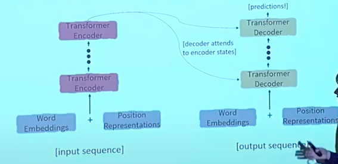

# Recurrent Neural Networks
RNNs have a number of disadvantages. For example, their running time is linear in the length of the sequence. Further, they struggle to learn long-distance dependencies, and are constrained to operate on the linear order of the words.

Moreover, their operations cannot be parallelised, which inhibits training on large datasets.

In view of these demerits, there are some potential alternatives to RNNs:

* Word window models (1-D convolution): A local context of words is used to find out information about the central word. The number of unparallelisable operations does not increase with sequence length, and it can be layered to allow interaction between farther words.
* Attention (independent of its application on RNNs): We can apply attention on the encoder's input to generate more accurate representations *of the same input* (similar to the word window model). All words in each layer attend to all words in the previous layer.

# Self-Attention
We have seen that attention operates on queries $q_1, \dots, q_T$, keys $k_1, \dots, k_T$ and values $v_1, \dots, v_T$. In self-attention, all three of these are drawn from the same source:
$$\begin{split}
q_i &= q(x_i) \\
k_i &= k(x_i) \\
v_i &= v(x_i). \end{split}$$

Thus, self-attention operates as
$$e_{ij} = q_i^Tk_j$$
$$\alpha_{ij} = \text{softmax}(e_{ij})$$
$$\text{output}_i = \sum_j \alpha_{ij} v_j$$

## Order
However, self-attention by itself cannot act as a replacement for RNNs. One of its major shortcomings is that it has no notion of order; it operates on *sets* of words.

We can incorporate positional information by representing each index as a vector $p_i$, and adding them to our representations
$$\begin{split}
\tilde{q_i} &= q_i + p_i \\
\tilde{k_i} &= k_i + p_i \\
\tilde{v_i} &= v_i + p_i \end{split}$$

We usually obtain $p_i$ by using sinusoids, as
$$p_i = \begin{bmatrix}
\sin\left(\frac{i}{10000^{\frac{2\cdot1}d}}\right) \\
\cos\left(\frac{i}{10000^{\frac{2\cdot1}d}}\right) \\
\vdots \\
\sin\left(\frac{i}{10000^{\frac{2\cdot\frac{d}2}d}}\right) \\
\cos\left(\frac{i}{10000^{\frac{2\cdot\frac{d}2}d}}\right) \end{bmatrix}$$

This representation indicates that absolute position is less important than relative position, and can extrapolate to bigger dimensions. However, these are not learnable.

An alternative is to learn the positional representations from scratch. This has the advantage of flexibility, but cannot be extrapolated.

## Nonlinearity
Our current implementation of self-attention has no nonlinearities; it simply takes an average of the value vectors. This problem is fixed by applying a feedforward network to all the outputs of an attention layer.

## Prediction
We have seen that self-attention takes into account *all* words in the sequence simultaneously. However, this leads to issues when we try to apply it to the decoder's output, since the tokens following the focus word have not yet been generated.

Thus, what we do here is to mask out attention to future words by setting their scores to $-\infty$. In other words,
$$e_{ij} = \begin{cases}
q_i^Tk_j & k < j \\
-\infty & k \geq j. \end{cases}$$

# Transformers
The transformer architecture, like that of RNNs, consists of two main blocks – the encoder and the decoder.

## Encoder
The encoder block takes in an input sequence which has positional information encoded in it. It computes query-key-value attention from the embeddings $x_i$ by ordinary matrix multiplication:
$$\begin{split}
k_i &= Kx_i \\
q_i &= Qx_i \\
v_i &= Vx_i \end{split}$$
These matrices allow different aspects of the embeddings to enter into the three representations.

Using matrix multiplication, the overall computation of attention is given by
$$\text{softmax}(XQ \cdot (XK)^T) \cdot XV.$$

Another important aspect of the transformer encoder is *multi-headed attention*, which allows it to attend to multiple places in the sentence at once. This is implemented by having multiple $Q, K, V$ matrices, each of which operates separately, and whose outputs are concatenated to obtain the final attended representations.

Thirdly, the encoder includes *residual connections*. This involves adding the value of the previous layer to the output of the application of a layer on it; thus the layer only has to learn the "difference" between two successive layers.  
Residual connections are thought to make the landscape of the loss function smoother, facilitating training.

Next, *layer normalisation* is a component of transformers that helps them to train faster. The idea behind it is to cut down on uninformative variation in hidden values by normalising them around 0. Mathematically, given $x_i$ with mean $\mu$ and standard deviation $\sigma$, the output is
$$\tilde{x_i} = \frac{x_i - \mu}{\sigma + \epsilon}.$$

Lastly, transformer encoders *scale the dot product*. When the dimensionality $d$ becomes large, the dot products explode, which makes the inputs to the softmax large and the gradients small. To avoid this, we divide the attention scores by $\sqrt{\frac{d}{h}}$:
$$\text{softmax}\left(\frac{XQ_l \cdot (XK_l)^T}{\sqrt\frac{d}{h}}\right) \cdot XV_l.$$

Thus, the overall encoder operates by first applying multi-headed attention, followed by a residual normalised layer, a feedforward layer, and another residual normalised layer. The output of these layers is given to the decoder.

## Decoder
The decoder, too, has a number of layers. It starts with a masked multi-headed self-attention layer (on the output sequence) and a residual normalised layer.

This is followed by multi-headed *cross-attention*. In cross-attention, the queries come from the decoder's output $z_i$, while the keys and values are drawn from the encoder's output $h_i$. Thus the output of this layer is computed as
$$\text{softmax}(ZQ \cdot (HK)^T) \cdot HV.$$

This is followed by another residual normalised layer, a feedforward layer, and a third residual normalised layer.

## Drawbacks
One major drawback of transformers is that the computation of self-attention is quadratic in the length of the sequence. Even though computation of self-attention is parallelisable, this is not desirable.

In practice, we bound the sequence length (usually at around 512).

Some other suggested methods have been to map the sequence length dimension to lower spaces, or to replace the all-pairs interactions with other families of attentions (like random interaction or window-based interaction).
