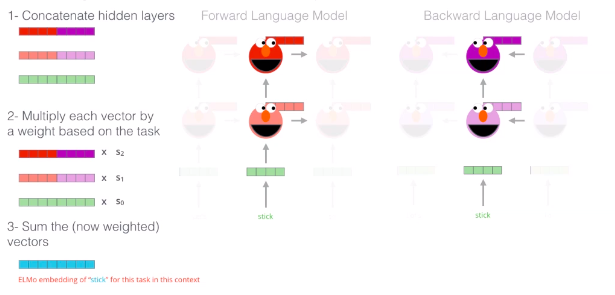

# Word Meaning Representations
We wish to have a representation of the meanings of words that numerically encapsulates the similarity between them.  
Word2Vec uses the context of words to define their vector representations. In a sense, we divide the meanings of words among $n$ aspects.  

We can use bidirectional RNNs (LSTMs) to generate representations that are informed by contexts to the left as well as the right. At a given position $t$, we can use $\overrightarrow{h}$ and $\overleftarrow{h}$ to create an *information complex* $c_t^1$.  
These can be further combined and recombined by bidirectional LSTMs, at each level creating more comprehensive information complexes $c_t^2$, $c_t^3$, and so on.  

In ELMo, the representation of $w_t$ is created by taking a weighted sum of concatenations of the hidden states at various levels.

