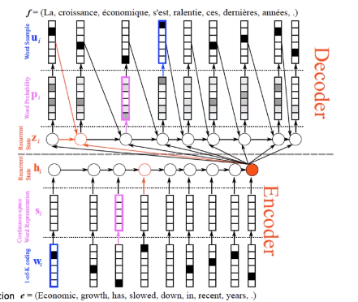
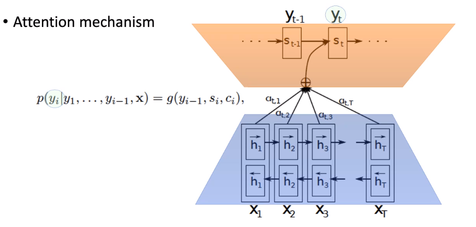

# Machine Translation (contd.)
There are two main types of neural machine translation systems.  

The first consists of sequence-to-sequence (seq2seq) models. These contain two RNNs, an *encoder* and a *decoder*. The encoder generates a representation of the source language sentence as a whole, which is converted by the decoder into a sentence in the target language.

The second approach is to identify "aligned" equivalents in parallel corpora (statistically). We use the co-occurrence counts of words in the source and target languages to find the probabilities that a given word translates into another given word.  
These use attention mechanisms to maintain the context along with the translation.

