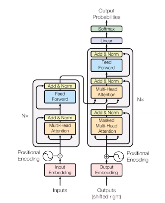

# Transformers
## Attention
We have seen that we reQuire a fully connected graph of the words in a sentence to get a complete picture of the dependencies and relations between the words. However, even this has very little meaning unless the edges have weights, *i.e.*, we have some idea of the relative importances of the dependencies and words. Attention (between the decoder and the encoder) helps us to achieve this.  

The idea of self-attention involves finding how important a certain word is to the focus word (both words being taken from the input). There are many functions that we could use for this:
$$\text{attn}(q_i,k_j) = \begin{cases}
\text{MLP}(q_i,k_j) \\
q_iWk_j \\
q_i \cdot k_j \end{cases}$$

$q_i \cdot k_j$ simply returns the similarity, however, which is not what we wish to encode via the importance relation. Two very dissimilar words may be important to each other in the meaning of a sentence.  
In order to factor this, therefore, we need a *transformation*, which is carried out by either of the other two alternatives. If we are using an MLP, we use two different matrices to transform $q_i$ and $k_j$.  

Thus there are three kinds of attention – encoder-decoder attention, encoder self-attention, and (masked) decoder self-attention (which is influenced by the words generated up to the present point).

## Architecture
Transformers are a new architecture that is based entirely on attention mechanisms, without any use of recurrence or convolutions.

In transformers, we pass a *value* $V$ also to the attention, which is scaled by the similarity score of $Q$ and $K$.
$$\text{attn}(Q,K,V) = \text{softmax}\left(\frac{QK^T}{\sqrt{d_K}}\right)V.$$