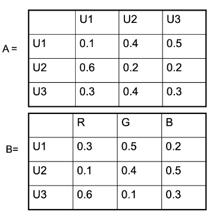

# Part-of-Speech Tagging
## Hidden Markov Models (contd.)
If we formalise the urn problem as an HMM, we would have $S = \{U_1, U_2, U_3\}$, and $V = \{R, G, B\}$. We would have the observation list $O = [o_1, \dots, o_n]$, and the state sequence $Q = [q_1, \dots, q_n]$.  
The parameters $A$ and $B$ are given in the figure. The initial probabilities $\pi_i$ are simply $P(q_1 = U_i)$.

The three basic problems of the HMM are then:

* given the observation sequence, estimate its overall likelihood, *i.e.*, efficiently estimate $P(O \mid \lambda)$.
* given the observation sequence, get the most likely state sequence
* how to adjust $\lambda = (A, B, \pi)$ to maximise $P(O \mid \lambda)$

### Likelihood of a Sequence
Suppose that there are $T$ observations, and $n$ states. Then there are $n^T$ paths in which the states can be traversed for $t$ steps. The sum over the likelihood of $O$ from each of these paths is the required probability.  

These likelihoods can be computed as
$$\begin{split}
P(O \mid Q, \lambda) &= \prod_{t=1}^T P(o_t \mid q_t, \lambda) \\
&= b_{q_1}(o_1) \dots b_{q_T}(o_T). \end{split}$$
This takes $T$ multiplications.  

Also,
$$P(Q \mid \lambda) = \pi_{q_1} \prod_{i=1}^{T-1} a_{q_i}{q_{i+1}}.$$
This also takes $T$ multiplications.

Finally, from
$$P(O \mid \lambda) = \sum_Q P(O, Q \mid \lambda),$$
we get
$$P(O \mid \lambda) = \sum_Q P(O \mid Q, \lambda)P(Q \mid \lambda).$$
The summation here is over $n^T$ elements.  

Thus the whole computation takes $2Tn^T$ steps, which is infeasible. We need a more efficient method.  

The forward and backward procedures are two ways to solve this problem.  

In the forward procedure, we define the forward variables as
$$\alpha_t(i) = P(o_1 \dots o_t, q_t = S_i \mid \lambda).$$
Thus, $\alpha_1(1)$ would be the probability that state 1 occurs at position 1 with observation 1. Note that this only involves the probability that $o_t$ was emitted from $q_t$, regardless of which states emitted $o_1 \dots o_{t-1}$.  
These can be calculated inductively. We initialise
$$\alpha_1(i) = \pi_i \cdot b_i (o_1),$$
and then we have
$$\alpha_{t+1}(j) = \left[ \sum_{i=1}^N\alpha_t(i)a_{ij} \right]b_j (o_{t+1}),$$
since the next $\alpha$ depends on the previous one, followed by the transition probability, followed by the emission probability.

We can then compute
$$P(O \mid \lambda) = \sum_{i=1}^N \alpha_T(i).$$

The backward procedure is similar, but it starts from the end of the graph. We define
$$\beta_t(i) = P(o_{t+1} \dots o_t \mid q_t = S_i, \lambda),$$
initialise them as
$$\beta_T(i) = 1, 1 \leq i \leq N,$$
and inductively calculate
$$\beta_{t-1}(j) = \sum_{i=1}^N a_{ji} \cdot b_i(o_{t+1}) \cdot \beta_t(i).$$

### Best State Sequence
The second problem is to find the state sequence that suits the observation sequence best. The solution lies in the Viterbi algorithm, which also proceeds inductively.  

First, we initialise two sets of variables, $\delta$ and $\psi$:
$$\delta_1(i) = \pi_i \cdot b_i(o_1)$$
$$\psi_1(i) = 0.$$

$\delta_t(i)$ is the probability of the best path so far that ends at state $i$, producing the sequence $o_1 \dots o_t$. While the $\delta$ stores the score, the sequence of $\psi$ stores the actual path.  

Then we can inductively calculate the next values:
$$\delta_{t+1}(j) = \max_{1 \leq i \leq N} [\delta_t(i) a_{ij}]b_j(o_t),$$
$$\psi_t(j) = \operatorname*{argmax \\}_{1 \leq i \leq N} [\delta_t(i) a_{ij}].$$

Finally, we terminate with
$$P^* = \max_{1 \leq i \leq N} \delta_T(i)$$
and
$$q_T^* = \operatorname*{argmax \\}_{1 \leq i \leq N} \delta_T(i),$$
$$q_t^* = \psi_{t+1}(q_{t+1}^*).$$

**Exercise.** Find the likelihood of, and the best state sequence for, $O = [R,R,G,G,B,R,G,R]$ with the above model, taking $\pi_i = \frac13$ for all $i$ (manually upto $[R, R, G, G]$).
