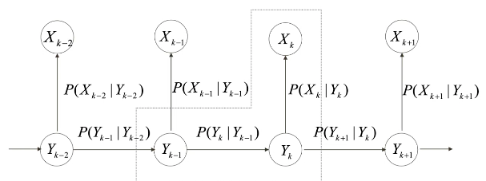

# Part-of-Speech Tagging
## Generative Modelling
We can consider the problem of POS tagging as a problem of recovering a message (a list of grammatical categories) overlaid with noise (which causes the actual output to be words). This model was also used for machine translation.  

Such a model, where the output is assumed to be generated by the labels we are trying to find, is called a generative model.  
We try to maximise the joint likelihood of training examples. HMMs are a type of generative models.

HMMs have some disadvantages, however. They do not use rich feature representations, and maximise joint probability rather than conditional probability.

## Maximum-Entropy Markov Models
MEMMs rely on local discriminative sub-models (like the dotted region in Figure 1). They unify two parameters in the generative model into one conditional model.  
In the notation of Figure 1, it works with $P(y_k \mid x_k, y_{k-1})$.  
Further, they employ the maximum entropy principle.  

In a general maximum-entropy model, the distribution $P(Y \mid X)$ is modelled with a set of features (0-1 indicator functions) $f_i$ defined on $X \times Y$. Training involves collecting information on these features. An example of a feature is
$$f_1(x,y) = \begin{cases}
1 & \text{if } x \text{ ends with -tion and } y \text{ is NN} \\
0 & \text{otherwise}. \end{cases}$$

We can empirically obtain
$$\hat{P}(f_i) = \frac1{|T|} \sum_{(x,y) \in T} f_i(x,y),$$
where $T$ is the training data.  
We would like $\hat{P}$ to approximate the expected value
$$P(f_i) = \frac1{|T|} \sum_{(x,y) \in T} \sum_{y' in D(Y)} P(y' \mid x) f_i (x, y'),$$
where $P(Y \mid X)$ is the distribution we want to model.  

The objective is to maximise the entropy
$$I = -\frac1{|T|} \sum_{(x,y) \in T} P(y \mid x) \log_2 P(y \mid x).$$

A disadvantage of MEMMs, however, is that they are extremely complex and computationally expensive. They are also slow to train.  
Furthermore, they perform local optimisation, unlike global maximisation as HMMs do.  

Other options include conditional random fields (CRFs), which assigns features to individual  words and tags.