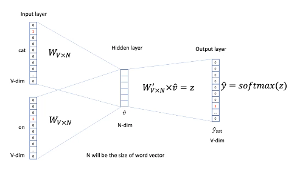

# Word2Vec
The idea of word2vec is to use the context of a word to create a vector representation of it. We would like these representations to be dense and efficiently computable.  

There are two neural network models which form the basis of word2vec:

* continuous bag of words (CBOW), where we use a window of words to predict the central word; and
* skip-gram (SG), where we use a word to predict the surrounding words in a window (independently).

We can start by representing words as one-hot vectors with $n =$ the vocabulary size. These vectors can be multiplied with a matrix $W_{V \times N}$ ($N$ is typically taken to be 300), which stores the actual semantic word vectors.  
We now have the word2vec representations, which we can manipulate and use for prediction.

We can evaluate the error in $\hat{y}$ (as compared to the true output) using MSE, for example.  

Word analogies are an interesting result that word vectors tend to have.