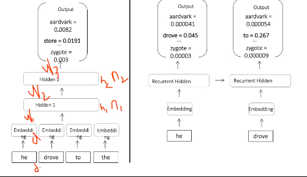
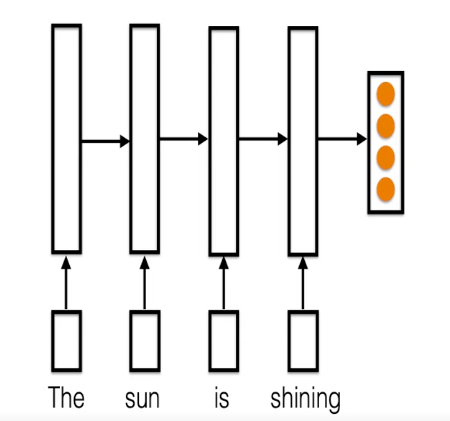
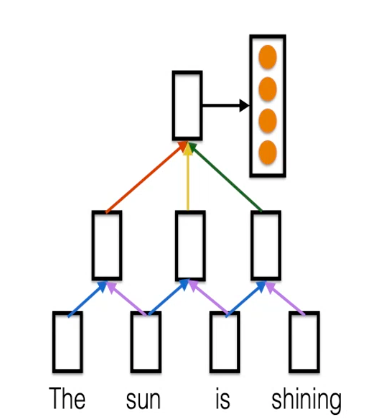
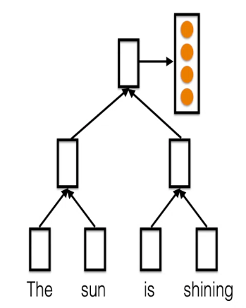

# Deep Learning and NLP
The outputs of vector representation learning models can be used as input to deep learning models for various tasks.

## Neural Network Language Models
Neural networks language carry out exactly the same task as statistical models, except that they use weights and biases and operate on the *representations* of the previous $(n-1)$ words. As output, they provide a probability distribution over the vocabulary, representing the likelihood of each word coming after the input $(n-1)$-gram.  

The fact that the representations are dense makes it possible to carry out the computation on any input, seen or unseen.  

A feed-forward NNLM simply uses the inputs of the $(n-1)$ input words simultaneously to generate the distribution.  
Recurrent NNLMs, on the other hand, use the output of each word to influence the output of the next. They aggregate the information from past decisions to inform future decisions.

We can use a recurrent architecture to obtain encodings of sentences, since their output is dependent on *all* previous inputs, making it compositional in a sense.

This, however, does not capture the non-sequential nature of the dependence of the output on inputs. To handle the hierarchical dependence, we can use a convolutional architecture.

A recursive architecture is similar, but does not make use of a sliding window; it more closely approximates the parse tree of the sentence.

