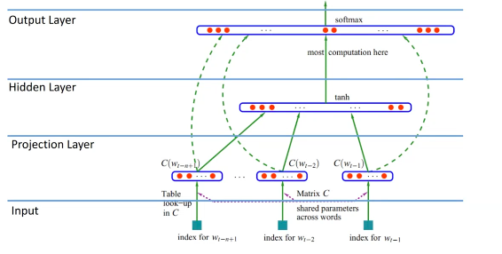
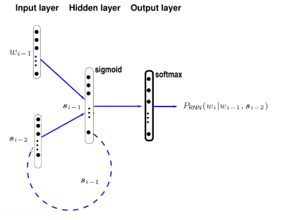
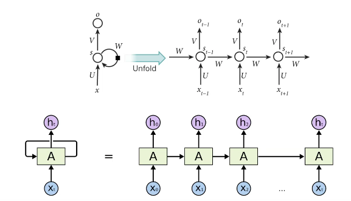
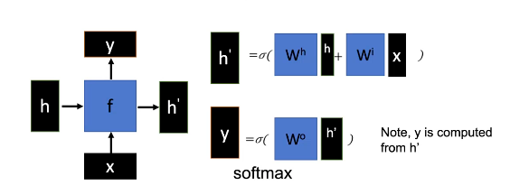
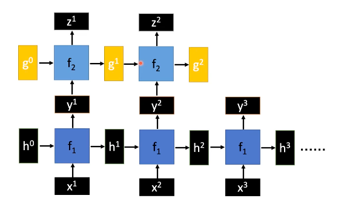
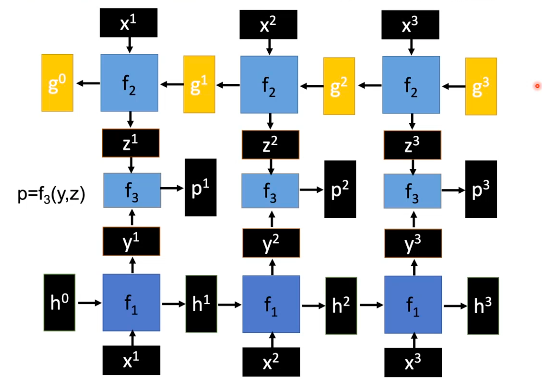
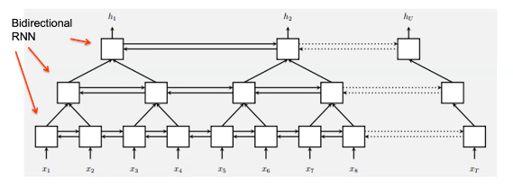

# Neural Network Language Models (contd.)
## Recurrent Neural Networks
A generic neural network language model has the form shown in Figure 1. Such an architecture solves the problems of sparsity and word similarity that occur in statistical models. However, they still have the disadvantage of having only a finite context.

This can be solved by using recurrent NNLMs. Each output is fed back into the model as the next input, in order to incorporate its context into the next decision.

We can "unfold" an RNN to get a better picture of its functioning.

RNNs *theoretically* solve the problem of the finite context, and is as computationally complex as generic NNLMs (the softmax function).  

The problem domain that we use RNNs for follow the assumption that language is time-invariant.  

### Functioning of RNNs
Given a hidden layer function $f$, the each pair of inputs $(h^i,x^{i+1})$ yields
$$(h^{i+1}, y^{i+1}) = f(h^i,x^{i+1}),$$
where $y^{i+1}$ is the output corresponding to $x^{i+1}$ and $h^{i+1}$ forms part of the next input (along with $x^{i+2}$).  

All the $h^i$ have the same dimension.  

Note that $f$ remains constant throughout the sequence; if it changes, it becomes a feedforward NN.  
Naive RNNs have the problem that they tend to forget old information (the vanishing gradient problem). We wish to retain the memory of distant relationships.  

Deep RNNs (or stacked RNNs) can also be used, which feed the $y^i$ into a different function. Thus we have two functions $f_1$ (which operates on $h^i$ and $x^{i+1}$, returning $y^i$) and $f_2$ (which operates on $g^i$ and $y^{i+1}$, returning $z^i$).

Bidirectional RNNs are another variation, which consist of two RNNs operating in opposite directions, whose outputs are combined by a third function $f_3$.

Pyramid RNNs are another extension, which have a hierarchical structure that reduces the number of time steps.

