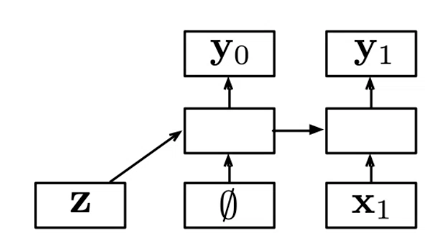
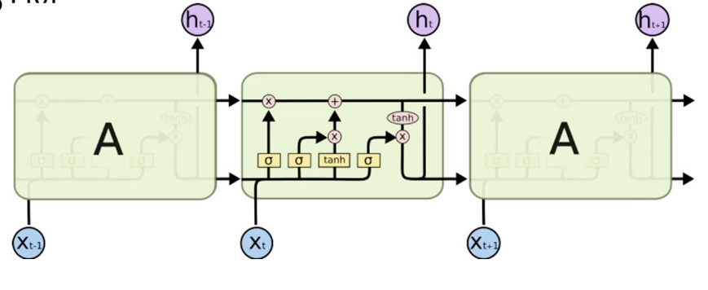
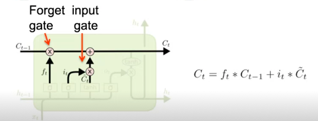
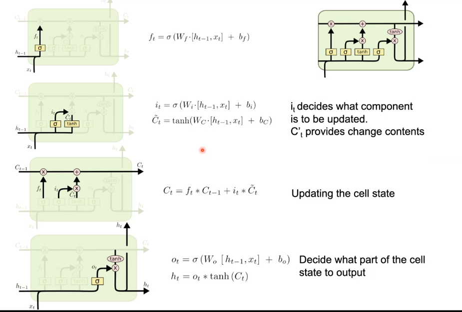

# Neural Network Language Models
## Recurrent Neural Networks (contd.)
We have seen that one issue with RNNs is the vanishing gradient problem.

### Conditional RNNs

## Long Short-Term Memory Networks

The core idea is that $c_t$ (the *cell state*) is changed slowly and information can flow along it unaltered. It can be used as a "context-storer" to retrieve necessary information from at any step.

