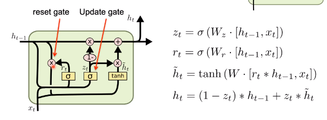
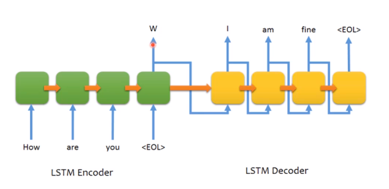
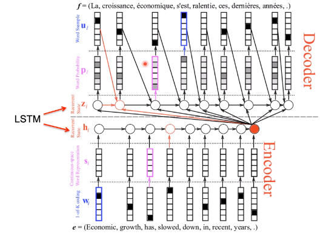

# Neural Network Language Models
## Long Short-Term Memory Networks
A modified version of LSTMs, the GRU (gated recurrent unit), merges the cell state $c_t$ and hidden state $h_t$. It also combines the *forget* and *input* gates into a single *update* gate.  
GRUs ensure that $h_t$ either retains a high amount of old information or starts over with a high amount of new information.

## Applications
### Sequence to Sequence Chat Model

### Neural Machine Translation

